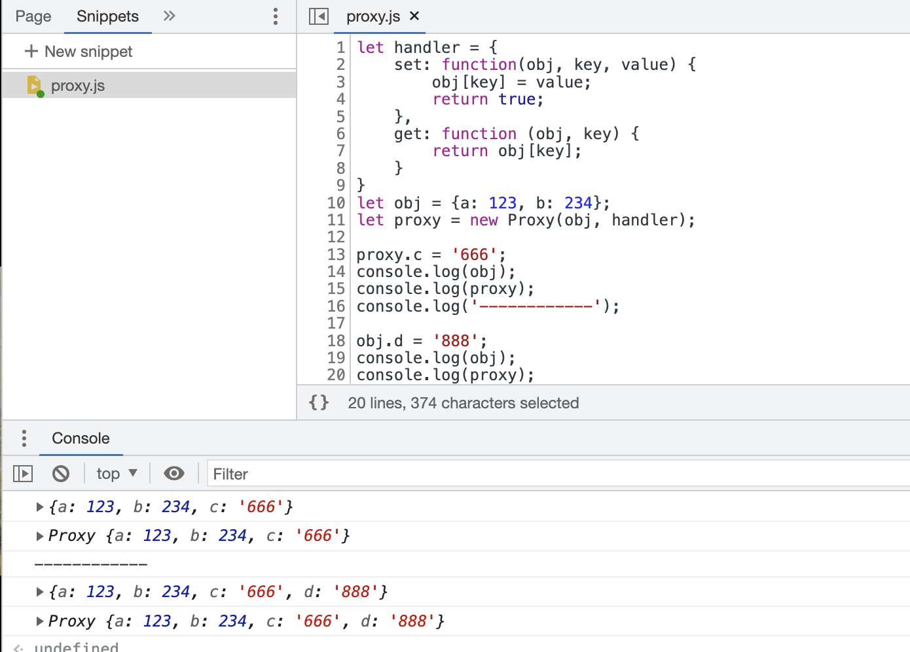

# 2022-10-25 reactivity

> index.ts 通常作为出口导出所有的 function

## 核心原理

```javascript
let proxy = new Proxy(target, baseHandler);
return proxy;
```

> Proxy 用于创建一个对象的代理，从而实现基本操作的拦截和自定义（如属性查找、赋值、枚举、函数调用等）

```javascript
let handler = {
  set: function (obj, key, value) {
    obj[key] = value;
    return true;
  },
  get: function (obj, key) {
    return obj[key];
  },
};
let obj = { a: 123, b: 234 };
let proxy = new Proxy(obj, handler);

proxy.c = "666";
console.log(obj);
console.log(proxy);
console.log("------------");

obj.d = "888";
console.log(obj);
console.log(proxy);
```



## WeakMap

key 必须是一个引用类型，可以自动进行垃圾回收，不会造成内存泄露。

